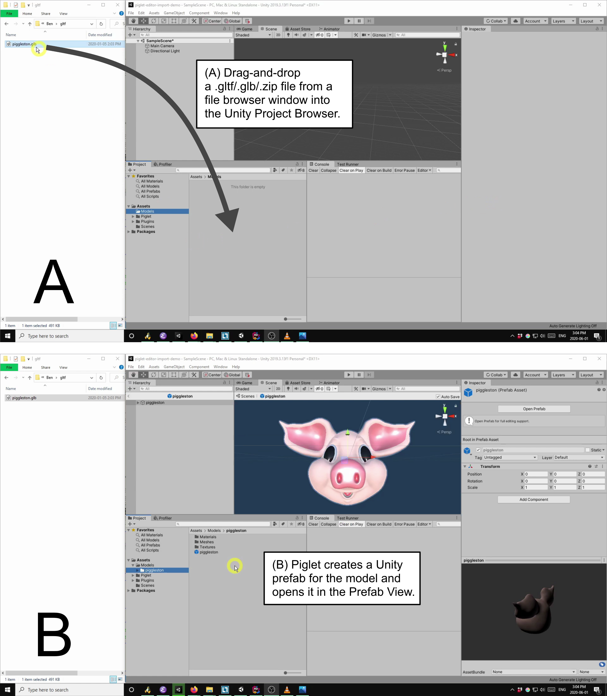
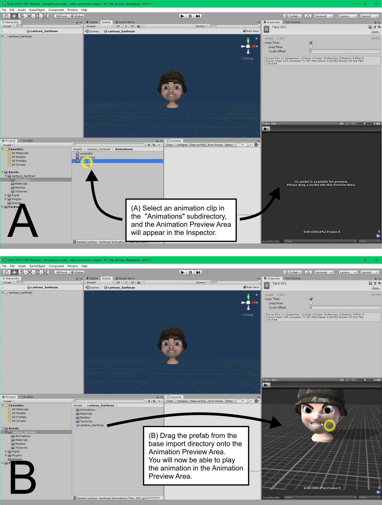
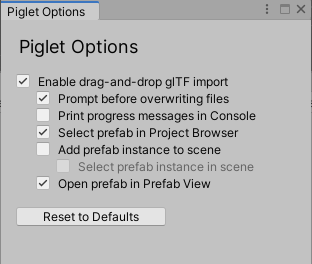
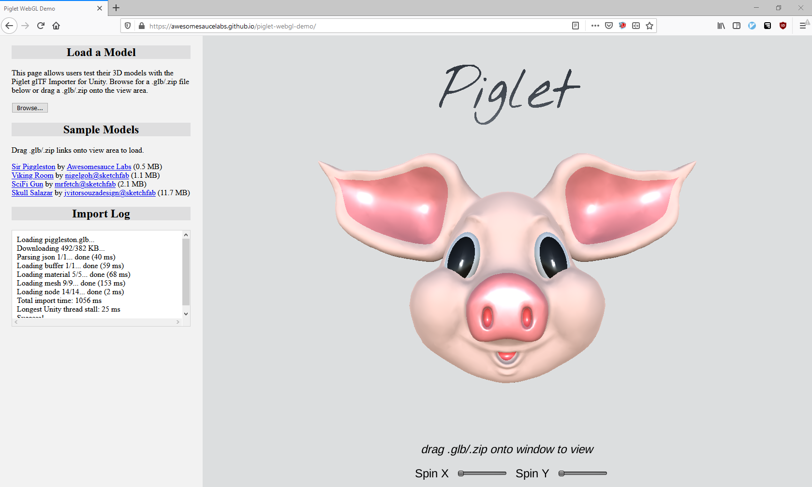

-   Online documentation:
    <https://awesomesaucelabs.github.io/piglet-manual/>
-   Support e-mail: <awesomesaucelabs@gmail.com>

{width="40%"}

# Table of Contents

* [Introduction](#introduction)
* [Features](#features)
* [Caveats](#caveats)
* [Setup](#setup)
* [Editor Imports](#editor-imports)
    * [Piglet Options Window](#piglet-options-window)
* [Runtime Imports](#runtime-imports)
    * [Runtime Import Tutorial](#runtime-import-tutorial)
    * [Runtime Import API](#runtime-import-api)
* [URP Support (Unity 2019.3+)](#urp-support)
* [Sample Application: PigletViewer](#piglet-viewer)
* [Footnotes](#footnotes)

# Introduction

Piglet is a Unity asset that allows you to import 3D models from glTF
files, both in the Editor and at runtime. This provides Unity developers
access to a large collection of free textures, materials, and models
from sites like [Sketchfab](https://sketchfab.com/) and [Google
Poly](https://poly.google.com)^[1](#footnote1)^.

Visit the [Web
Demo](https://awesomesaucelabs.github.io/piglet-webgl-demo/)^[2](#footnote2)^
to try Piglet before you buy it.

# Features

-   import glTF models in the Editor or at runtime
-   import glTF models from `.gltf`, `.glb`, or `.zip` files, using file
    paths or HTTP URLs
-   extract textures and materials from glTF models, for use with your
    own 3D models
-   tested with glTF models from [Sketchfab](https://sketchfab.com/),
    [Google Poly](https://poly.google.com)^[1](#footnote1)^, and
    [Blender](https://www.blender.org/)
-   supported platforms: Windows, Android, WebGL (Unity 2018.4 or newer)
-   full source code provided

# Caveats

-   **Runtime imports may stall the main Unity thread**. I have
    done my best to minimize interruptions to the main Unity thread during
    runtime imports, but I cannot provide any hard guarantees about this
    yet. Unity requires certain operations (e.g. texture uploads to the GPU,
    mesh creation) to be performed on the main Unity thread, so it is possible for
    runtime imports to cause "hiccups" during game execution.

# Setup

To set up Piglet in your project, purchase and install Piglet from the
Unity Asset Store page. Piglet works with Unity 2018.4 or later, and
does not require installation of any third-party dependencies. If you
wish to try your own glTF models with Piglet prior to purchasing the
asset, please see the [Piglet WebGL
Demo](https://awesomesaucelabs.github.io/piglet-webgl-demo/).

Piglet bundles the following libraries:

  Library                                                     Author                                                                   License       Path
  ----------------------------------------------------------- ------------------------------------------------------------------------ ------------- ------------------------------------------
  [Json.NET](https://www.newtonsoft.com/json)                 [Newtonsoft](https://www.newtonsoft.com)                                 MIT License   `Assets/Piglet/Dependencies/Json.NET`
  [SharpZipLib](https://github.com/icsharpcode/SharpZipLib)   [icsharpcode@github](https://github.com/icsharpcode)                     MIT License   `Assets/Piglet/Dependencies/SharpZipLib`
  [UnityGLTF](https://github.com/sketchfab/UnityGLTF)         [Khronos](https://www.khronos.org/)/[Sketchfab](https://sketchfab.com)   MIT License   `Assets/Piglet/Dependencies/UnityGLTF`

*Note*: If your Unity project already includes one of these libraries
(e.g. Json.NET), you may get errors in the Unity Console due to
duplicate function/class definitions. In most cases, removing Piglet's
copy of the library under `Assets/Piglet/Dependencies` should solve the
issue.

# Editor Imports

*Note*: For a video demonstration of Piglet Editor imports, see
<https://youtu.be/wf26w0gcVcA>.

Once you have installed Piglet from the Unity Asset Store, you can
import glTF models into your Unity project by dragging-and-dropping
`.gltf`/`.glb`/`.zip` files from a file browser window (e.g. Windows
File Explorer) to a folder inside the Unity Project Browser (Figure 1).
Any folder under `Assets` can be used as the drop target, including the
`Assets` directory itself.

Importing a glTF file in the Editor produces a Unity prefab for the
model, which can then be dragged into your Unity scenes as desired.
Piglet places the generated prefab and any dependent asset files (e.g.
textures, materials, meshes) under a newly-created subfolder named after
the input `.gltf`/`.glb`/`.zip` file.

{#editor-import-figure width="100%"}

*Figure 1: Importing a glTF model in the Editor. (A) The user
drags-and-drops a .gltf/.glb/.zip file from Windows File Explorer to the
Unity Project Browser window. (B) Piglet creates a Unity prefab for the
model and opens it in the Prefab View.*

There may be circumstances where you want copy a `.gltf`/`.glb`/`.zip`
file into your project without automatically converting it to a Unity
prefab. You can bypass/disable Piglet's default drag-and-drop behaviour
by any of the following methods:

-   Hold down the `Control` or `Command` key while dragging-and-dropping
    the `.gltf`/`.glb`/`.zip` into the Unity Project Browser.
-   Uncheck `Enable drag-and-drop glTF import` in the Piglet Options
    window, located under `Window => Piglet Options` in the Unity menu.
-   Copy the `.gltf`/`.glb`/`.zip` file into the Unity project directory
    from a file browser window or on the command line. (In other words,
    copy the file "behind Unity's back".)

## Working with Animations

Piglet can import and play animations from glTF files, both in the
Editor and at runtime.  This section describes how to work with
animations created during Editor imports.

### Previewing Animations in the Editor

If a glTF file contains animations, Piglet will create an additional
`Animations` subdirectory containing: (1) an `AnimatorController`
asset (`controller`) for playing the animations at runtime, (2) a
"Static Pose" `AnimationClip` for resetting the model to its default
pose, and (3) one `AnimationClip` asset for each animation from the
glTF file (Figure XXX). The `controller` asset is not needed for
previewing animations and is further explained in [Playing (Mecanim)
Animations at Runtime](#playing--mecanim--animations-at-runtime).

To preview an glTF animation in the Editor, first select the
AnimationClip asset in the Project Browser window (Figure XXX). This
will cause a blank Animation Preview Area to appear in the Inspector
window with the message `No model is available for preview. Please
drag a model into this Preview Area`. Next, drag the prefab for the
imported glTF model (located one level up from the `Animations`
folder) onto the Animation Preview Area. You will then be able to
click the Play button to view the animation.

{#animation-preview-figure width="100%"}

*Figure XXX: Previewing an animation clip in the Editor.(A) The user selects an animation clip in the "Animations"
subdirectory, causing the Animation Preview Area to appear in the
Inspector window (bottom right).  (B) The user drags the prefab from
the main import directory onto the Animation Preview Area, in order to
associate the model with the animation clip. The user is now able to
play the animation in the Animation Preview Area. **Attribution**: These
screenshots use the [Cartoon
Hartman](https://sketchfab.com/3d-models/morpher-animated-face-military-cartoon-hartman-538a674c39e24c15965231ab2bdb656a)
model by Willy Decarpentrie, skudgee@sketchfab, under the CC Attribution
License.*

### Playing (Mecanim) Animations at Runtime

## Piglet Options Window

A number of options relating Editor imports can be set in the Piglet
Options window, located under `Window => Piglet Options` in the Unity
menu.



  Option                                 Description
  -------------------------------------- ----------------------------------------------------------------------------------------------------------------------------------------------------------------------------------------------------------------------------------------
  `Enable drag-and-drop glTF import`     Enable/disable automatic glTF imports when dragging .gltf/.glb/.zip files onto the Project Browser window
  `Prompt before overwriting files`      Show confirmation prompt if glTF import directory already exists
  `Print progress messages in Console`   Log progress messages to Unity Console window during glTF imports (useful for debugging)
  `Select prefab in Project Browser`     After a glTF import has completed, select/highlight the generated prefab in the Project Browser window
  `Add prefab instance to scene`         After a glTF import has completed, add the generated prefab to the current Unity scene, as a child of the currently selected game object. If no game object is selected in the scene, add the prefab at the root of the scene instead.
  `Select prefab instance in scene`      Select/highlight the prefab in the scene hierarchy after adding it to the scene
  `Open prefab in Prefab View`           After a glTF import has completed, open the generated prefab in the Prefab View. (This is equivalent to double-clicking the prefab in the Project Browser.)

# Runtime Imports

Piglet can import a glTF model at runtime from a file path, an HTTP URL,
or a `byte[]` array containing the raw byte content of a .gltf/.glb/.zip
file. Runtime imports are performed incrementally, with minimum possible
interruption to the main Unity thread.

## Runtime Import Tutorial

This section walks through example code for importing a glTF model at
runtime. The example code in this section is included with Piglet under
`Assets/Piglet/Examples/RuntimeImport`, and a video version of this
tutorial is available online at <https://youtu.be/f66wmgSTPI0>.

As our example glTF model, we will use the `.glb` file for Sir
Piggleston (the Piglet mascot), which may be downloaded from
<https://awesomesaucelabs.github.io/piglet-webgl-demo/StreamingAssets/piggleston.glb>.
The minimal code to import the model at runtime is as follows:

```cs
using Piglet;
using UnityEngine;

/// <summary>
/// This MonoBehaviour provides a minimal example for using
/// Piglet to import glTF models at runtime.
/// </summary>
public class RuntimeImportBehaviour : MonoBehaviour
{
    /// <summary>
    /// The currently running glTF import task.
    /// </summary>
    private GltfImportTask _task;

    /// <summary>
    /// Unity callback that is invoked before the first frame.
    /// Create the glTF import task.
    /// </summary>
    void Start()
    {
        // Note: To import a local .gltf/.glb/.zip file, you may
        // instead pass an absolute file path to GetImportTask
        // (e.g. "C:/Users/Joe/Desktop/piggleston.glb"), or a byte[]
        // array containing the raw byte content of the file.

        _task = RuntimeGltfImporter.GetImportTask(
                "https://awesomesaucelabs.github.io/piglet-webgl-demo/StreamingAssets/piggleston.glb");
    }

    /// <summary>
    /// Unity callback that is invoked after every frame.
    /// Here we call MoveNext() to advance execution
    /// of the glTF import task.
    /// </summary>
    void Update()
    {
        // advance execution of glTF import task
        _task.MoveNext();
    }
}
```
*Figure 2: Minimal code to import a glTF file at runtime.*

As shown in Figure 2, a runtime glTF import happens in two parts. First,
we create an import task by calling `RuntimeGltfImporter.GetImportTask`,
passing in the URL of the glTF model as a parameter. To load a local
.gltf/.glb/.zip file, we may instead pass `GetImportTask` an absolute
file path (e.g. "C:/Users/Joe/Desktop/piggleston.glb") or a `byte[]`
array containing the raw byte content of the file. Second, we advance
the execution of the import task by repeatedly calling `MoveNext()` on
the task. A convenient place to call `MoveNext()` is in the `Update()`
method, which is called by Unity once per frame. Continuing to call
`MoveNext()` after the import has completed does no harm.

Attaching the script from Figure 2 to any game object in your Unity
scene is sufficient to import a glTF model at runtime. However, in a
real game/application, you will probably want tighter integration
between your own code and the importer. For example, you may want to
show progress messages while the model is loading, or to attach custom
MonoBehaviours to the model once it has loaded. To achieve these types
of behaviours, `GltfImportTask` provides callback hooks for: progress
messages (`OnProgress`), user cancelation (`OnAborted`), import errors
(`OnException`), and successful completion (`OnCompleted`).

As a first example of callback usage, we'll extend the example script
from Figure 2 to print progress messages during the glTF import. We can
achieve this by assigning a custom method to the `OnProgress` callback
for the import task, as shown in Figure 3.

```cs
using Piglet;
using UnityEngine;

/// <summary>
/// This MonoBehaviour provides a minimal example for using
/// Piglet to import glTF models at runtime.
/// </summary>
public class RuntimeImportBehaviour : MonoBehaviour
{
    /// <summary>
    /// The currently running glTF import task.
    /// </summary>
    private GltfImportTask _task;

    /// <summary>
    /// Unity callback that is invoked before the first frame.
    /// Create the glTF import task.
    /// </summary>
    void Start()
    {
        // Note: To import a local .gltf/.glb/.zip file, you may
        // instead pass an absolute file path to GetImportTask
        // (e.g. "C:/Users/Joe/Desktop/piggleston.glb"), or a byte[]
        // array containing the raw byte content of the file.

        _task = RuntimeGltfImporter.GetImportTask(
                "https://awesomesaucelabs.github.io/piglet-webgl-demo/StreamingAssets/piggleston.glb");
        _task.OnProgress = OnProgress;
    }

    /// <summary>
    /// Callback that is invoked by the glTF import task
    /// to report intermediate progress.
    /// </summary>
    /// <param name="step">
    /// The current step of the glTF import process.  Each step imports
    /// a different type of glTF entity (e.g. textures, materials).
    /// </param>
    /// <param name="completed">
    /// The number of glTF entities (e.g. textures, materials) that have been
    /// successfully imported for the current import step.
    /// </param>
    /// <param name="total">
    /// The total number of glTF entities (e.g. textures, materials) that will
    /// be imported for the current import step.
    /// </param>
    private void OnProgress(ImportStep step, int completed, int total)
    {
        Debug.LogFormat("{0}: {1}/{2}", step, completed, total);
    }

    /// <summary>
    /// Unity callback that is invoked after every frame.
    /// Here we call MoveNext() to advance execution
    /// of the glTF import task.
    /// </summary>
    void Update()
    {
        // advance execution of glTF import task
        _task.MoveNext();
    }
}
```

*Figure 3: An extension of the runtime import script from Figure 2 that
prints progress messages to the Unity console. In comparison to Figure 2,
the new parts of the code are the `OnProgress` method and the assignment
of `OnProgress` to `_task.OnProgress` in `Start`.*

Another important use of callbacks is to run custom code after a glTF
import has successfully completed. For example, you might want to
automatically resize the model, parent the model to another game object,
or attach a custom `MonoBehaviour` to the model. These types of tasks
can be accomplished using the `OnCompleted` callback. To demonstrate,
the example script in Figure 4 uses the `OnCompleted` callback to obtain
a reference to the imported model, then uses that reference to
continually spin the model about the y-axis as if it were on a record
turntable.

The example in Figure 4 marks the end of this tutorial. Good luck and
happy coding!

```cs
using Piglet;
using UnityEngine;

/// <summary>
/// This MonoBehaviour provides a minimal example for using
/// Piglet to import glTF models at runtime.
/// </summary>
public class RuntimeImportBehaviour : MonoBehaviour
{
    /// <summary>
    /// The currently running glTF import task.
    /// </summary>
    private GltfImportTask _task;

    /// <summary>
    /// Root GameObject of the imported glTF model.
    /// </summary>
    private GameObject _model;

    /// <summary>
    /// Unity callback that is invoked before the first frame.
    /// Create the glTF import task.
    /// </summary>
    void Start()
    {
        // Note: To import a local .gltf/.glb/.zip file, you may
        // instead pass an absolute file path to GetImportTask
        // (e.g. "C:/Users/Joe/Desktop/piggleston.glb"), or a byte[]
        // array containing the raw byte content of the file.

        _task = RuntimeGltfImporter.GetImportTask(
            "https://awesomesaucelabs.github.io/piglet-webgl-demo/StreamingAssets/piggleston.glb");
        _task.OnCompleted = OnComplete;
    }

    /// <summary>
    /// Callback that is invoked by the glTF import task
    /// after it has successfully completed.
    /// </summary>
    /// <param name="importedModel">
    /// the root GameObject of the imported glTF model
    /// </param>
    private void OnComplete(GameObject importedModel)
    {
        _model = importedModel;
        Debug.Log("Success!");
    }

    /// <summary>
    /// Unity callback that is invoked after every frame.
    /// Here we call MoveNext() to advance execution
    /// of the glTF import task.
    /// </summary>
    void Update()
    {
        // advance execution of glTF import task
        _task.MoveNext();

        // spin model about y-axis
        if (_model != null)
            _model.transform.Rotate(0, 1, 0);
    }
}
```

*Figure 4: An extension of the runtime import script from Figure 2 that
spins the imported model about the y-axis. In comparison to Figure 2,
the new parts of the code are the `OnComplete` method, the
assignment of `OnComplete` to `_task.OnCompleted` in `Start`,
and the call to `_model.transform.Rotate` in `Update`.*

## Runtime Import API

In Piglet, a runtime glTF import is accomplished by the following steps:

1.  Create a `GltfImportTask` by calling
    `RuntimeGltfImporter.GetImportTask`, passing in the file path or URL
    of the input `.gltf`/`.glb`/`.zip` as a parameter.
2.  Configure callbacks on the `GltfImportTask` (optional).
3.  Call `MoveNext()` on the `GltfImportTask` until the glTF import has
    completed.

For concrete code examples demonstrating the above steps, see the
[Runtime Import Tutorial](#runtime-import-tutorial).

`RuntimeGltfImporter` provides the following methods for creating a
`GltfImportTask`:

  Method                         Return Type        Description
  ------------------------------ ------------------ --------------------------------------------------------------------------------------------------------------------------------------------------------------------------------------
  `GetImportTask(string uri)`    `GltfImportTask`   Create an import task that imports the glTF model from `uri`, where `uri` is an absolute file path, HTTP(S) URL, or Android content URI that points to a `.gltf`/`.glb`/`.zip` file.
  `GetImportTask(Uri uri)`       `GltfImportTask`   Create an import task that imports the glTF model from `uri`, where `uri` is an absolute file path, HTTP(S) URL, or Android content URI that points to a `.gltf`/`.glb`/`.zip` file.
  `GetImportTask(byte[] data)`   `GltfImportTask`   Create an import task that imports from the raw byte content of a `.gltf`/`.glb`/`.zip` file (`data`).

  : RuntimeGltfImporter Methods

`GltfImportTask` provides the following methods for controlling its own
execution:

  Method         Description
  -------------- -----------------------------------------------------------------------------------------------------------------------------------------
  `MoveNext()`   Advance execution of the import task by a small increment. This method should be called repeatedly until the import task has completed.
  `Abort()`      Abort the import task. This method should typically be called in response to a user action, such as pressing a "Cancel" button.

  : GltfImportTask Methods

In addition, `GltfImportTask` provides the following callbacks for
integrating custom code with the importer:

  Callback        Description
  --------------- -------------------------------------------------------------------------
  `OnProgress`    Invoked at regular intervals to report progress of `GltfImportTask`
  `OnAborted`     Invoked when `Abort()` is called on `GltfImportTask`
  `OnException`   Invoked when `GltfImportTask` throws an exception (e.g. file not found)
  `OnCompleted`   Invoked when `GltfImportTask` completes successfully

  : GltfImportTask Callbacks

# URP Support (Unity 2019.3+) {#urp-support}

Piglet supports the Universal Render Pipeline (URP) in Unity 2019.3 or
newer. To use Piglet in a URP-based project, simply unpack the URP
shader files in `Assets/Piglet/Extras/URPShaders.unitypackage`. (If you
to forget unpack `URPShaders.unitypackage`, glTF imports will fail with
an error message reminding you to install the shaders.)

# Sample Application: PigletViewer {#piglet-viewer}

{#webgl-demo-figure width="800"}

*Figure 5: A screenshot of PigletViewer, a sample application which uses
Piglet to view 3D models from glTF files.*

PigletViewer is sample application which uses Piglet to view 3D models
from glTF files (\`.gltf\`, \`.glb\`, or \`.zip\`), and which is used
for the [Piglet Web
Demo](https://awesomesaucelabs.github.io/piglet-webgl-demo/). For the
benefit of Piglet customers, I have published the source code and
documentation for PigletViewer online at
<https://github.com/AwesomesauceLabs/piglet-viewer>, under an MIT
license. PigletViewer currently supports builds for Android, WebGL, and
Windows, and thus it may be a useful reference for Piglet users
developing for those platforms. In general, I recommend looking at the
[Runtime Import Tutorial](#runtime-import-tutorial) before exploring the
PigletViewer code, as the tutorial provides a much more succinct
introduction to the Piglet API.

# Footnotes

1\. As of June 2020, Google Poly only provides glTF download links for
models made with [Google Blocks](https://arvr.google.com/blocks/) (as
opposed to [Tilt Brush](https://www.tiltbrush.com/)). To see only
Blocks-generated models on Google Poly, visit
<https://poly.google.com/blocks>.

2\. I have tested the [Piglet Web
Demo](https://awesomesaucelabs.github.io/piglet-webgl-demo/) with
Firefox and Google Chrome on Windows 10 64-bit. If you are using Google
Chrome, you can improve performance of the demo by [turning on hardware
acceleration](https://www.lifewire.com/hardware-acceleration-in-chrome-4125122)
(i.e. GPU acceleration) in the browser settings. Currently this option
is disabled in Chrome by default.
